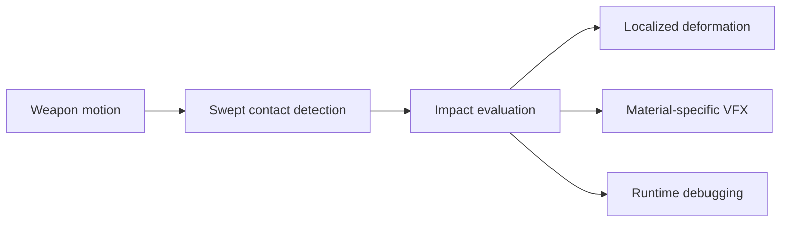

# Project Kinetica

**Physics-inspired combat impact feedback / Technical Art study**  
**Unity 6 / Universal Render Pipeline (URP)**  
**Personal project · Frozen implementation**

Selected source and technical documentation from Project Kinetica.

This repository is not the complete Unity project. It is a portfolio-oriented snapshot of selected, user-authored implementation files and small configuration examples.

- Main visual case study: [Project Kinetica — Technical Art Portfolio](https://dull-pigeon.github.io/Technical-Art-Portfolio/projects/kinetica/)
- Showcase Video: **Final Showcase link will be added after publication.**

## Frozen source provenance

The files in this repository were selected from the private development repository `Dull-Pigeon/Project-Kinetica` at frozen commit `eb011e727cf2e4299ad9a5585ee6a5ecf75b9e35`.

That reference is provided for provenance only; the private development repository is not presented as a publicly accessible dependency. This public repository has a separate, clean Git history.

## Implemented pipeline

`WeaponCollision` samples an animated detection point in `FixedUpdate`. During an attack window, a `SphereCast` covers the segment travelled since the previous physics step. Detection radius and contact area are intentionally separate controls: radius sets the swept collision volume, while area is used by impact evaluation and is passed to the deformation receiver as the impact radius.

The sampled `mass × velocity` value is momentum-inspired impact strength, not a claim that the implementation computes physical force through `F = ma`. `ImpactSolver` combines directional alignment, weapon/material hardness, and effective pressure to classify an impact as `Glanced`, `Deflected`, `Squashed`, or `Penetrated`.

`ImpactReceiver` sends localized impact position and response values to the deformation Shader Graph through a per-renderer `MaterialPropertyBlock`. Material hardness attenuates deformation; elasticity influences deformation scale, oscillation frequency, decay, hold time, and rebound.

Weapon and physical-material presets are stored as ScriptableObjects. `WeaponCollision` calls deformation directly on the receiver, then publishes an `ImpactData` event observed by the VFX and Debug systems. VFX selection comes from the physical-material preset.

`Penetrated` and `isBroken` are classifications only. The frozen implementation does not perform real penetration, mesh fracture, or destruction. No measured performance benchmark is claimed.

## Selected contents

- `Source/Runtime/` — swept collision, impact evaluation, deformation receiver, and VFX event handling.
- `Source/Data/` — `ImpactData`, `ImpactResult`-related dependencies, and ScriptableObject schemas.
- `Source/Debug/` — runtime debug-panel event observer.
- `Data/` — small frozen ScriptableObject preset examples for Hammer, Sword, Spear, Slime, Stone, and Metal.
- `Shader/ShaderGraph_ImpactDeform.shadergraph` — the frozen localized-deformation Shader Graph, built from Unity/URP Shader Graph nodes and containing no packaged weapon source assets.
- `Docs/` — reserved location for the confirmed final Technical Breakdown PDF.

The selected files preserve the frozen implementation, including original source filenames and behavior. The repository is intentionally not arranged or supplied as a runnable Unity project.

## Technical Breakdown

The final Technical Breakdown PDF is not included yet. When the confirmed final version is available, add it as:

`Docs/Project-Kinetica-Technical-Breakdown.pdf`

An older or editable document should not be substituted for that final PDF.

## Third-party material

Third-party source assets and audio are not distributed here. See [THIRD_PARTY_NOTICES.md](THIRD_PARTY_NOTICES.md) for attribution and exclusion details.

No blanket open-source license is provided. Third-party material remains subject to its original license terms.
